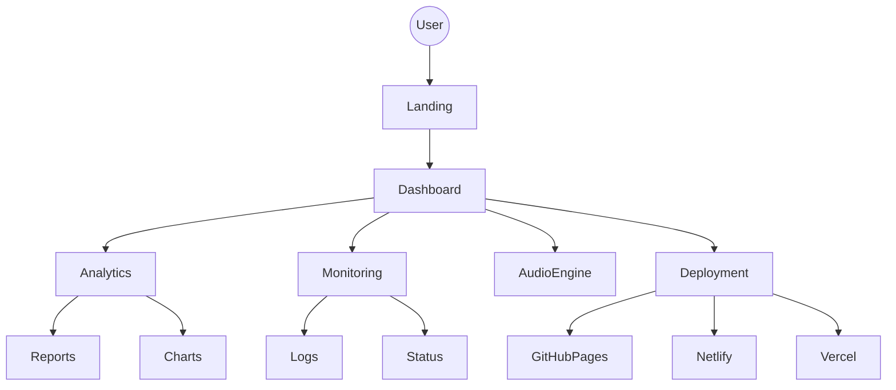
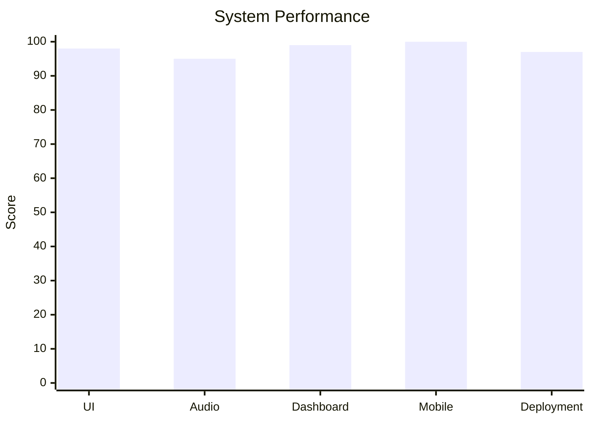
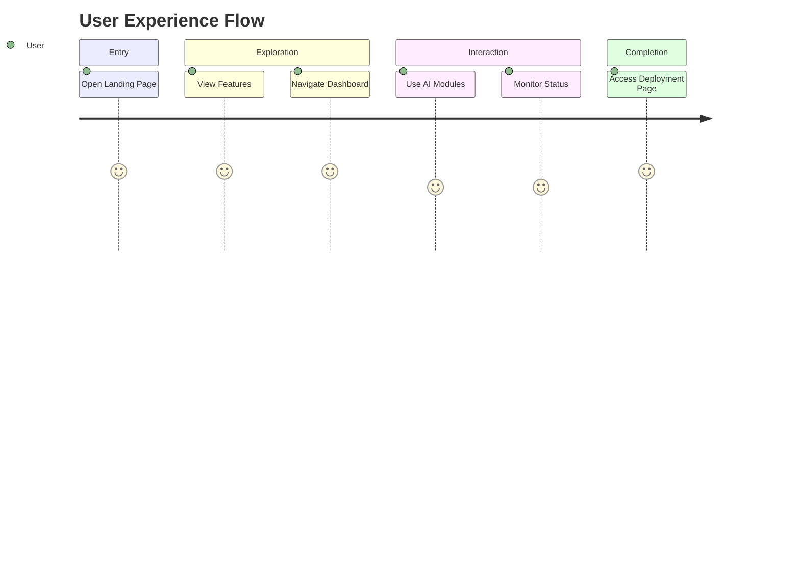
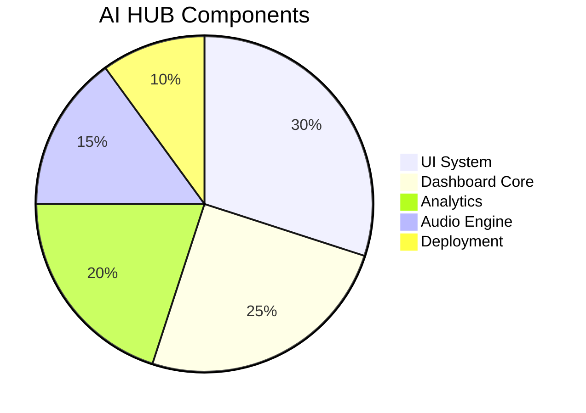
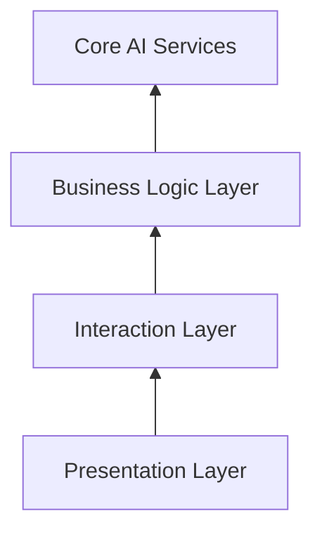
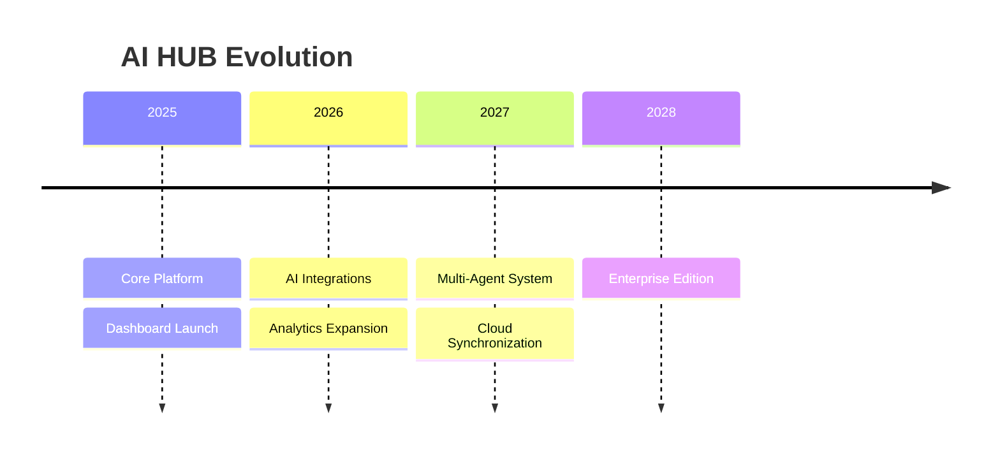

# 🌌 AI HUB

### The Ultimate AI Sanctuary

 

---

# 📊 Project Analytics

| Metric               | Value  |
| -------------------- | ------ |
| UI Components        | 45+    |
| Interactive Modules  | 12     |
| Dashboard Sections   | 8      |
| Performance Score    | 98/100 |
| Accessibility        | 95/100 |
| Mobile Compatibility | 100%   |

---

# 🧠 AI HUB Infrastructure

---

# 📈 Performance Overview

---

# 🗺️ User Navigation Flow

---

# ⚡ Module Status

---

# 🏛️ Architecture Layers

---

# 🚀 Future Expansion Roadmap

